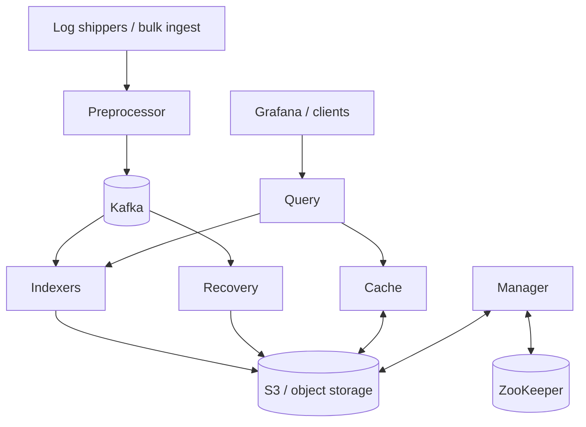

# KalDB

[](https://github.com/kaldb/kaldb/actions/workflows/maven.yml)
[](LICENSE)
[](https://kaldb.com/docs/)
[](https://github.com/kaldb/kaldb)

KalDB is a cloud-native log search and analytics engine built for high-volume observability workloads. It combines OpenSearch-compatible APIs with a decoupled architecture: Kafka for durable ingest, Lucene for indexing, and S3 for indexed storage.

[Quick Start](#quick-start) • [Architecture](#architecture-overview) • [Docs](https://kaldb.com/docs/) • [Talks](#talks-and-architecture-deep-dives) • [Contributing](.github/CONTRIBUTING.md)

> Historical note: parts of the codebase, APIs, and docs still use the original `Astra` name while the project transitions to `KalDB`.

## Why KalDB

- Built for log-heavy workloads with spiky ingest patterns and long retention requirements.
- OpenSearch-compatible ingest and query APIs reduce migration work for existing pipelines and dashboards.
- Decoupled compute and storage lets you scale indexing and querying separately.
- Native support for logs, traces, and audit-style event data.
- Designed to work well with Grafana, Zipkin-compatible trace tooling, and cloud object storage.

## Why It Exists

KalDB was created to solve the practical problems that show up when log search becomes large enough to hurt: ingest delays during traffic spikes, schema conflicts from fast-moving services, and operational complexity from running many large search clusters. The architecture and public talks around KalDB focus on a simple idea: keep the search experience fast, but move durability and long-term storage onto systems that scale more naturally for cloud-native environments.

## Architecture Overview

KalDB is a Lucene-based system inspired by aggregator/leaf/tailer style architectures. Kafka handles durable ingest, S3 stores indexed data, and stateless indexers can be scaled independently to keep fresh data searchable during spikes.



Core properties of the design:

- Fresh-data ingest is prioritized during peak load.
- Indexer nodes are stateless, which makes horizontal scaling straightforward.
- Storage and query paths are separated so long retention does not force expensive hot storage everywhere.
- Existing OpenSearch-oriented tooling can often be reused instead of rewritten.

## Quick Start

If you want the shortest path to a local cluster, use the helper script:

```bash
./quick_start.sh --clean
```

If you prefer to see each step explicitly, the manual flow is:

### Prerequisites

- Docker with Compose support
- `curl`
- JDK 21 if you want to build or run the project outside Docker

### 1. Build the local image and start dependencies

```bash
docker build -t slackhq/astra .
docker compose up
```

### 2. Create the Kafka topic used by the local example

```bash
docker exec dep_kafka kafka-topics.sh \
  --create \
  --topic test-topic-in \
  --if-not-exists \
  --bootstrap-server localhost:9092
```

### 3. Create dataset metadata and assign a partition

```bash
curl -XPOST \
  -H 'content-type: application/json; charset=utf-8; protocol=gRPC' \
  'http://localhost:8083/slack.proto.astra.ManagerApiService/CreateDatasetMetadata' \
  -d '{
    "name": "test",
    "owner": "test@email.com",
    "serviceNamePattern": "_all"
  }'

curl -XPOST \
  -H 'content-type: application/json; charset=utf-8; protocol=gRPC' \
  'http://localhost:8083/slack.proto.astra.ManagerApiService/UpdatePartitionAssignment' \
  -d '{
    "name": "test",
    "throughputBytes": "4000000",
    "partitionIds": ["0"]
  }'
```

You can also inspect cluster metadata in the manager UI at `http://localhost:8083/docs`.

### 4. Ingest a sample log line

```bash
curl --location 'http://localhost:8086/_bulk' \
  --header 'Content-type: application/x-ndjson' \
  --data '{ "index" : { "_index" : "test", "_id" : "100" } }
{ "@timestamp": "2024-03-07T12:00:00.000Z", "level": "INFO", "message": "This is a log message", "service-name": "test" }
'
```

### 5. Query it back

```bash
curl --location 'http://localhost:8081/_msearch' \
  --header 'Content-type: application/x-ndjson' \
  --data '{ "index": "test"}
{"query" : {"match_all" : {}, "gte":1625156649889,"lte":2708540790265}, "size": 500}
'
```

Local endpoints:

- Query API: `http://localhost:8081`
- Manager API and admin UI: `http://localhost:8083`
- Preprocessor ingest API: `http://localhost:8086`
- Grafana: `http://localhost:3000/explore`
- Zipkin UI: `http://localhost:9411`

## What You Can Build With It

### Log search with Lucene-style queries

KalDB supports Lucene query syntax for field filters, wildcards, boolean queries, ranges, and optional full-text search. See [docs/topics/Logs.md](docs/topics/Logs.md) for examples and Grafana integration details.

### Trace search with a Zipkin-compatible API

KalDB can store and serve traces when the required span fields are indexed. See [docs/topics/Traces.md](docs/topics/Traces.md) for the expected schema and Grafana setup.

### OpenSearch-oriented migrations

KalDB exposes OpenSearch-compatible APIs for query and ingest workflows, which helps reuse existing shippers, clients, and dashboards. See [docs/topics/Migrating.md](docs/topics/Migrating.md) and [docs/topics/API-opensearch.md](docs/topics/API-opensearch.md).

## Developer Setup

### Local development

- Import the repository as a Maven project in IntelliJ.
- The `.run/` directory contains run configurations for each node role.
- Shared runtime defaults live in `config/config.yaml`.
- CI builds with JDK 21.

### Common commands

```bash
mvn package
mvn -B -Dstyle.color=always com.spotify.fmt:fmt-maven-plugin:check --file astra/pom.xml
mvn -B -Dstyle.color=always com.spotify.fmt:fmt-maven-plugin:check --file benchmarks/pom.xml
```

### Repository map

- `astra/`: core server, APIs, indexing, query, metadata, and node implementations
- `config/`: local configuration and Grafana provisioning
- `docs/`: architecture, operations, APIs, and getting-started material
- `benchmarks/`: JMH benchmarks for indexing and API workloads
- `tools/`: helper tools such as the span generator and UI tests

## Learn More

- [KalDB website](https://kaldb.com/)
- [Documentation](https://kaldb.com/docs/)
- [Getting started guide](docs/topics/Getting-started.md)
- [Architecture guide](docs/topics/Architecture.md)
- [Cluster recommendations](docs/topics/Recommendations.md)
- [Roadmap](docs/topics/Roadmap.md)

## Talks And Architecture Deep Dives

- Monitorama 2022: KalDB: A k8s Native Log Search Platform
- Strange Loop 2022: KalDB: A Cloud Native Log Search Platform
- Berlin Buzzwords 2023: KalDB: Serverless Lucene at Petabyte Scale
- SREcon APAC 2023: Taming Spiky Log Volumes with KalDB

The public talks complement the architecture docs well: the docs explain the components, while the talks explain the operational pressure and design tradeoffs that shaped them.

## Contributing

Contributions to code, docs, tests, and developer tooling are all useful. Start with [.github/CONTRIBUTING.md](.github/CONTRIBUTING.md), check open issues, and look for a good first issue if you want a smaller entry point.

## License

KalDB is released under the [MIT License](LICENSE).
