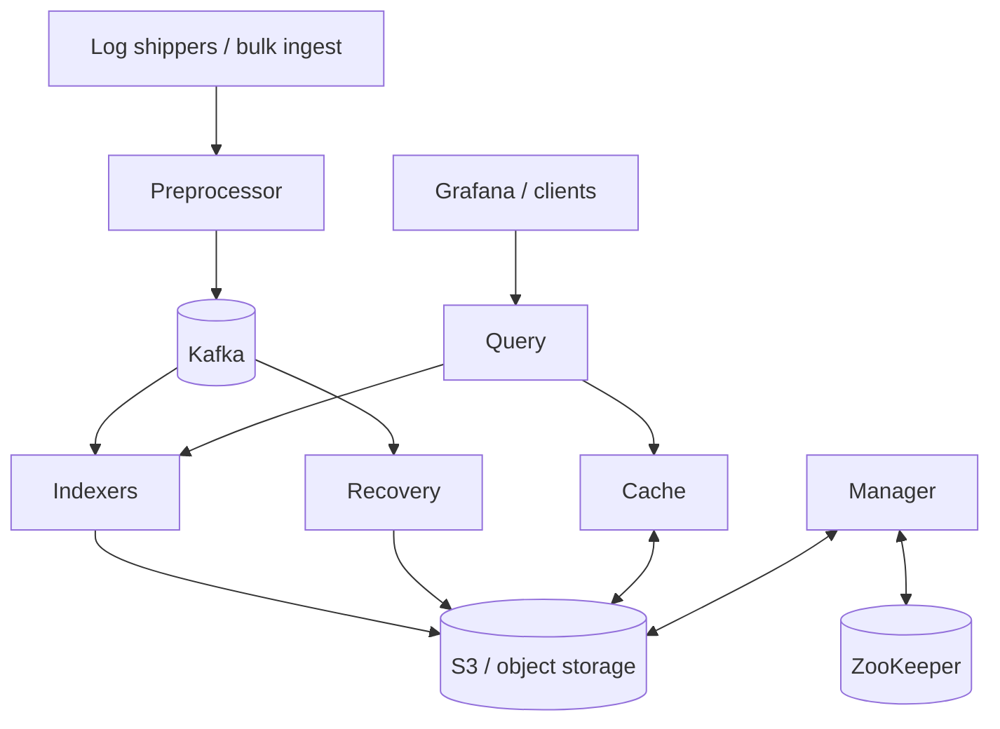

# KalDB

[](https://github.com/kaldb/kaldb/actions/workflows/maven.yml)
[](LICENSE)
[](https://kaldb.com/docs/)

KalDB is a cloud-native log search and analytics engine built for high-volume observability workloads. It combines OpenSearch-compatible APIs with a disaggregated storage architecture: Kafka for durable ingest, Lucene for indexing, and S3 for indexed storage.

[Quick Start](#quick-start) • [Architecture](#architecture-overview) • [Docs](https://kaldb.com/docs/) • [Talks](#talks-and-architecture-deep-dives) • [Contributing](.github/CONTRIBUTING.md)

[Star it!](https://github.com/kaldb/kaldb)

> KalDB builds on the Astra codebase originally open-sourced by Slack and reflects production learnings from large-scale deployments at Slack and Airbnb. The project is in transition, and parts of the codebase, APIs, and docs still use the original `Astra` name.

## Why KalDB

- Built for log-heavy workloads with spiky ingest patterns and long retention requirements.
- OpenSearch-compatible ingest and query APIs reduce migration work for existing pipelines and dashboards.
- Decoupled compute and storage lets you scale indexing and querying separately.
- Native support for logs, traces, and audit-style event data.
- Designed to work well with Grafana, Zipkin-compatible trace tooling, and cloud object storage.

## Why It Exists

KalDB was created to solve practical problems that show up as log search scales.
These include ingest delays during traffic spikes, schema conflicts from fast-moving services, and operational complexity from running many large search clusters.
The architecture and public talks around KalDB focus on a simple idea: keep the search experience fast, but move durability and long-term storage onto systems that scale more naturally for cloud-native environments.

## Architecture Overview

KalDB is a Lucene-based system inspired by aggregator/leaf/tailer-style architectures. Kafka handles durable ingest, S3 stores indexed data, and stateless indexers can be scaled independently to keep fresh data searchable during spikes.



Core properties of the design:

- Fresh-data ingest is prioritized during peak load.
- Indexer nodes are stateless, which makes horizontal scaling straightforward.
- Storage and query paths are separated so long retention does not force expensive hot storage everywhere.
- Existing OpenSearch-oriented tooling can often be reused instead of rewritten.

## Quick Start

If you want the shortest path to a local cluster, use the helper script:

```bash
./quick_start.sh --clean
```

Local endpoints:

- Query API: `http://localhost:8081`
- Admin UI: `http://localhost:8083/admin/`
- Manager API: `http://localhost:8083`
- Preprocessor ingest API: `http://localhost:8086`
- Grafana: `http://localhost:3000/explore`
- S3Mock: `http://localhost:19090`

For the manual curl workflow, API examples, and the per-service setup details, see [Getting-started.md](docs/topics/Getting-started.md).

## What You Can Build With It

### Log search with Lucene-style queries

KalDB supports Lucene query syntax for field filters, wildcards, boolean queries, ranges, and optional full-text search. See [Logs.md](docs/topics/Logs.md) for examples and Grafana integration details.

### Trace search with a Zipkin-compatible API

KalDB can store and serve traces when the required span fields are indexed. See [Traces.md](docs/topics/Traces.md) for the expected schema and Grafana setup.

### OpenSearch-oriented migrations

KalDB exposes OpenSearch-compatible APIs for query and ingest workflows, which helps reuse existing shippers, clients, and dashboards. See [Migrating.md](docs/topics/Migrating.md) and [API-opensearch.md](docs/topics/API-opensearch.md).

## Developer Setup

### Local development

- Import the repository as a Maven project in IntelliJ.
- The `.run/` directory contains run configurations for each node role.
- Shared runtime defaults live in `config/config.yaml`.
- CI builds with JDK 21.

### Common commands

```bash
mvn package
```

### Repository map

- `astra/`: core server, APIs, indexing, query, metadata, and node implementations
- `config/`: local configuration and Grafana provisioning
- `docs/`: architecture, operations, APIs, and getting-started material
- `benchmarks/`: JMH benchmarks for indexing and API workloads
- `tools/`: helper tools such as the span generator and UI tests

## Learn More

- [KalDB website](https://kaldb.com/)
- [Documentation](https://kaldb.com/docs/)
- [Getting-started.md](docs/topics/Getting-started.md)
- [Architecture.md](docs/topics/Architecture.md)
- [Recommendations.md](docs/topics/Recommendations.md)
- [Roadmap.md](docs/topics/Roadmap.md)

## Talks And Architecture Deep Dives

- [Monitorama 2022: KalDB: A k8s Native Log Search Platform](https://www.youtube.com/watch?v=CQKXzQ1yyEQ)
- [Strange Loop 2022: KalDB: A Cloud Native Log Search Platform](https://www.youtube.com/watch?v=TNf_oqm7JQQ)
- [Berlin Buzzwords 2023: KalDB: Serverless Lucene at Petabyte Scale](https://www.youtube.com/watch?v=Xs-aNMg94ck)
- [SREcon APAC 2023: Taming Spiky Log Volumes with KalDB](https://www.youtube.com/watch?v=GKV1m_w6mFc)

The public talks complement the architecture docs well: the docs explain the components, while the talks explain the operational pressure and design tradeoffs that shaped them.

## Contributing

See [CONTRIBUTING.md](.github/CONTRIBUTING.md) and open issues.
